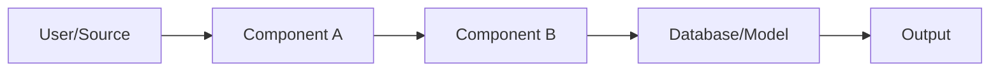

<h1 align="center">
  <a href="https://github.com/CommunityOfCoders/Inheritance2k25">
    CoC Inheritance 2025
  </a>
  <br>
  ArchiTech: “Vastu Principles, Powered by Logic.”
</h1>

<div align="center">
By Code4Cure
</div>
<hr>

<details>
<summary>Table of Contents</summary>

- [Description](#description)
- [Links](#links)
- [Tech Stack](#tech-stack)
- [Progress](#progress)
- [Future Scope](#future-scope)
- [Applications](#applications)
- [Project Setup](#project-setup)
- [Team Members](#team-members)
- [Mentors](#mentors)

</details>

## 📝 Description

ArchiTEch is an intelligent floor-plan generation application that creates Vastu-compliant layouts using minimal inputs such as plot size and house type (1BHK, 2BHK, or 3BHK). It uses Operations Research and constraint-based logic to optimize space and bridge the gap between user needs and practical architectural design.

## 🔗 Links

- https://github.com/sejal-176/CodeForCure_ArchiTech.md.git
- [Demo Video]([Insert Link])
- [Project Screenshots/Drive]([Insert Link])
- [Hosted Website]([Insert Link])

## 🤖 Tech-Stack

### 🏗️ System Architecture



### Front-end:Typescript,Tailwindcss

### Back-end:Flask Python API

### Database / Blockchain / ML (Optional Sections)

## 📈 Progress

### Fully Implemented Features

* **Feature One**: [Description of feature one].
* **Feature Two**: [Description of feature two].
* **Feature Three**: [Description of feature three].

---

### Partially Implemented Features / Work in Progress

* **Feature A**: [Description of current status and what remains].
* **Feature B**: [Description of current status].

## 🔮 Future Scope

* [Integration of X technology].
* [Expansion to Y platforms].
* [User authentication updates].

## 💸 Applications

1. **Application Area 1** - [How this project applies to this area].
2. **Application Area 2** - [How this project applies to this area].

## 🛠 Project Setup

1. Clone the GitHub repo.

```bash
git clone https://github.com/sejal-176/CodeForCure_ArchiTech.md.git

```

2. Enter the project directory and install dependencies.

```bash
cd [directory_name]
npm install

```

3. Start the application.

```bash
npm start

```

## 👨‍💻 Team Members

* **Aishwarya Jadhav**: AishVerse
* **Rudrani Wadelkar**: rudrani29
* **Shreya Kale**: Shreysk21
* **Sejal Bodakhe**: sejal-176

## 👨‍🏫 Mentors

* **Ishaan Shaikh**: [GitHub/LinkedIn Link]
* **Vedant Anasune**: [GitHub/LinkedIn Link]
