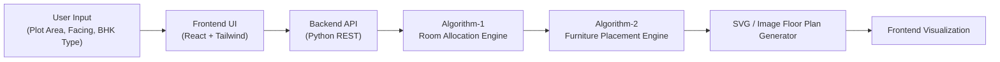

<h1 align="center">
  <a href="https://github.com/CommunityOfCoders/Inheritance2k25">
    CoC Inheritance 2025
  </a>
  <br>
  ArchiTech: “Vastu Principles, Powered by Logic.”
</h1>

<div align="center">
By Code4Cure
</div>
<hr>

<details>
<summary>Table of Contents</summary>

- [Description](#description)
- [Links](#links)
- [Tech Stack](#tech-stack)
- [Progress](#progress)
- [Future Scope](#future-scope)
- [Applications](#applications)
- [Project Setup](#project-setup)
- [Team Members](#team-members)
- [Mentors](#mentors)

</details>

## 📝 Description

ArchiTech is an intelligent floor-plan generation application that creates Vastu-compliant layouts using minimal inputs such as plot size and house type (1BHK, 2BHK, or 3BHK). It uses Operations Research and constraint-based logic to optimize space and bridge the gap between user needs and practical architectural design.

## 🔗 Links

- https://github.com/sejal-176/CodeForCure_ArchiTech.md.git
- [Demo Video]([Insert Link])
- [Project Screenshots/Drive]([Insert Link])
- [Hosted Website]([Insert Link])

## 🤖 Tech-Stack

### 🏗️ System Architecture




### Front-end:Typescript,Tailwind CSS

### Back-end:Python REST API 

### Constraint-Based rule engine

## 📈 Progress

### Fully Implemented Features

* **Automatic Vastu-Compliant Floor Plan Generation**:
  1. Generates 1BHK, 2BHK, and 3BHK floor plans
  2. Uses Vastu Shastra rules (direction, zoning, room placement)
  3. Produces standard 2D top-view plans with:
       3.1. Connected rooms
       3.2. Recognizable furniture symbols
       3.3. Doors, windows, parking, puja room
       3.4. North arrow & dimension annotations
  4. Output generated as SVG / image.
   
* **Automatic Furniture Placement**:
  1. Furniture placed relative to room geometry, not random
  2. Room-specific rule sets:
       2.1. Living Room (sofa, TV, table, etc.)
       2.2. Bedroom (bed, wardrobe, dressing)
       2.3. Kitchen (platform, sink, stove, fridge)
       2.4. Toilet/Bathroom (WC, sink)
  3. Fully rule-based and extensible.
   
* **Vastu Compliance Detection & Scoring**:
  1. Users can upload an existing floor plan image
  2. System analyzes:
       2.1. Room positions
       2.2. Orientation
       2.3. Violations of Vastu rules
  3. Generates:
       3.1. Vastu Compliance Score
       3.2. Suggestions for improvement
  4. Helps users understand what is wrong and how to fix it

### Partially Implemented Features / Work in Progress

* **Feature A**: [Description of current status and what remains].
* **Feature B**: [Description of current status].

## 🔮 Future Scope

* [3D visualization and walkthrough of generated floor plans].
* [Enhanced vastu scoring with priority-based rule weighting].
* [Support for duplex, villas, and commercial layouts].
* [User accounts with saved designs and version tracking].
* [Mobile-friendly interface for on-site usage].


## 💸 Applications

1. **Residential House Planning** - It enables homeowners to obtain accurate, Vastu-compliant designs without requiring deep architectural or traditional Vastu expertise.
2. **Educational & Academic Use** - It helps architecture, civil, and computer science students understand the real-world application of constraint satisfaction, Operations Research, and rule-based systems through an interactive, problem-solving approach.

## 🛠 Project Setup

1. Clone the GitHub repo.

```bash
git clone https://github.com/sejal-176/CodeForCure_ArchiTech.md.git

```

2. Enter the project directory and install dependencies.

```bash
cd ArchiTech
npm install

```

3. Start the application.

```bash
npm start

```

## 👨‍💻 Team Members

* **Aishwarya Jadhav**: AishVerse
* **Rudrani Wadelkar**: rudrani29
* **Shreya Kale**: Shreysk21
* **Sejal Bodakhe**: sejal-176

## 👨‍🏫 Mentors

* **Ishaan Shaikh**: Ishaan0132
* **Vedant Anasune**: VEDLESS
